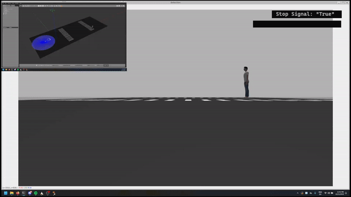

# Project 08: Detection of crosswalks in AVs

## Project presentation


## Setup
Clone this repo:
```
git clone https://gitlab.msu.edu/yaxjacob/av_project_08.git
```
Clone the yolov5 repo and install its requirements:
```
git clone https://github.com/ultralytics/yolov5
cd yolov5
pip install -r requirements.txt
```
Follow this folder hierarchy:
```
ros_ws/
├─ src/
│  ├─ av_project_08/
│  ├─ yolov5/
```

## Running
In the `ros_ws` workspace, build the `project` package:
```
colcon build --symlink-install packages-select project
```

Launch the gazebo world:
```
cd project/launch
ros2 launch crosswalk.launch.py
```

Run the detection, signal, and drive node:
```
ros2 run project detect
ros2 run project stopsignal
ros2 run project drive
```

The `drive` node moves the turtlebot forward at different speed, depending on the signals from the other two nodes. The robot moves with a velocity of 1.0 when no crosswalks are detected, 0.3 when a crosswalk is detected, and stops when both a stop signal and a crosswalk is detected.

## Demonstration


## Datasets
The dataset for the simulated world is located in `data_sim` and the trained weights are located at `runs/train/exp3/weights/best.pt`. The data for real world crosswalk is located in `data` and the weights are located at `runs/train/exp2/weights/best.pt`.
